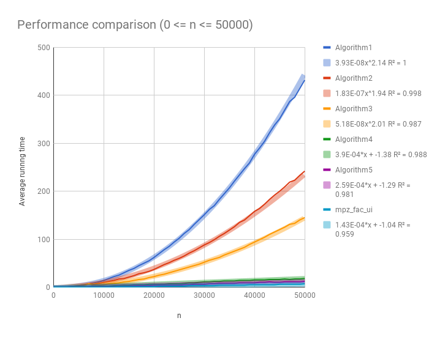
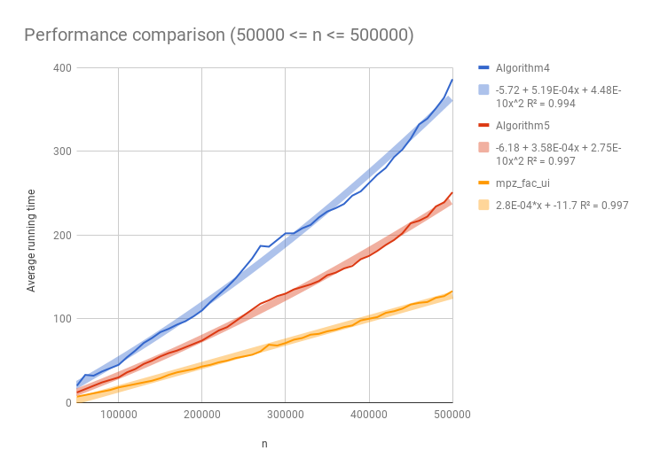
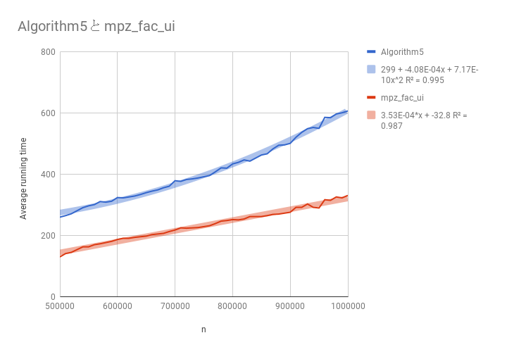
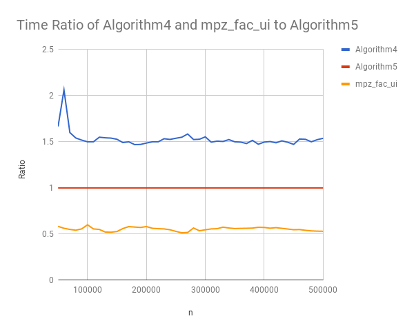
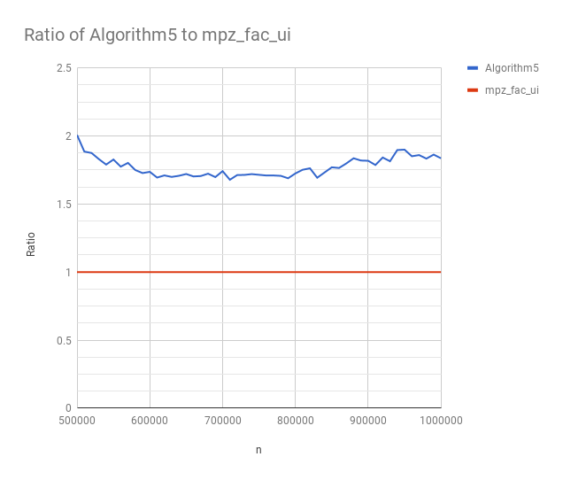

# Performance comparison of fundamental algorithms for computing factorial
------

## Abstract
This memo describes fundamental algorithms for computing factorial and its performance.

## Algorithms
Here is a brief description of each algorithm.

### Algorithm1
```cpp
mpz_class Factorial1(unsigned int n)
{
	mpz_class x = 1;
	for(mpz_class i = 2;i <= n;++i)
	{
		x *= i; // 1 * 2 * 3 * ... * n
	}
	return x;
}
```
This is a most obvious algorithm, which is derived from the definition of factorial.

### Algorithm2
```cpp
mpz_class Factorial2(unsigned int n)
{
	mpz_class k = (n / 2) + 1;
	mpz_class m = n;
	mpz_class s = 0;
	mpz_class result = k;
	m -= k;
	k *= k;
	for(mpz_class i = 1;i <= m;++i)
	{
		s += ((i << 1) - 1);
		result *= (k - s);
	}
	return result;
}
```
Multiplying each terms from the "center" of continuous product of factorial, then n! would be represented as follows:  
    n! = n * (n - 1) * ... * (k + 2) * (k + 1) * k * (k - 1) * (k - 2) * ... * 4 * 3 * 2 (n is even)  
or  
    n! = n * (n - 1) * ... * (k + 2) * (k + 1) * k * (k - 1) * (k - 2) * ... * 3 * 2 * 1 (n is odd)  
where k = [n / 2] ( [x] means smallest integer which is not smaller than x.)  
With little observation, we notice that each pair of (k + i) and (k - i) (i = 1,2,3...) produce k^2 - i^2.
If both (k + i) and (k - i) are large enough, multiplying them would be done by fast multiplication algorithm such as schonhage-strassen algorithm.
While Algorithm1, which is multiplying number from 1 to n, might not use fast multiplication algorithm untill multiplicand/multiplier exceeds certain number (threthold),
this algorithm uses fast multiplication algorithm as soon as possible because product `k * (k^2 - 1) * (k^2 - 4) * ...` grows faster than `1 * 2 * 3 * ...`. (**k^2 is roughly equal to (n^2)/4**)
**also note that k^2 needs to be calculated only once and each i^2 (1,4,9....) are calculated, in above code, by bit shift,subtraction and addition, which are faster than normal multiplication**
Thus, this algorithm is faster than Algorithm1.

### Algorithm3
```cpp
mpz_class Factorial3(unsigned int n)
{
	mpz_class x = 1;
	if (n == 0) return 1;
	if (n < 3) return n;
	for(mpz_class y = 1;y <= n;y += 2)
	{
		x *= y; // 1 * 3 * 5 * ...
	}
	return (x * Factorial3(n >> 1)) << (n >> 1);
}
```
Strategy of this algorithm is different from that of algorithm2.
By rearraging each number, `n * (n - 1) * ... * 4 * 3 * 2 * 1` would be `(1 * 3 * 5 * ...) * (2 * 4 * 6 * ...)`  
Then `2 * 4 * 6 * ...` would be `(2 * 1) * (2 * 2) * (2 * 3) * ... = 2^([n/2]) * 1 * 2 * 3 * ... * ([n/2])`  
Hence, `n! = 1 * 3 * 5 * .... * (([n/2])! * 2^[n/2])`  
Algorithm3 depends on this simple formula.
**note that multiplying 2^[n/2] is implemented as bit shift**

#### Algorithm4
```cpp
mpz_class mul_odd(unsigned int high,unsigned int low)
{
	if ((high - low) <= 4)
	{
		if ((high - low) == 0)
		{
			return high;
		}
		else if ((high - low) == 2)
		{
			return mpz_class(high) * low;
		}
		return mpz_class(high) * low * (low + 2);
	}
	uint64_t m = high;
	m = (m + low) >> 1;
	if ((m & 1) == 0) --m;
	return mul_odd(high, m + 2 /* (m + 2) might not fit in unsigned int */) * mul_odd(m, low);
}
mpz_class Factorial4(unsigned int n)
{
	if (n < 2) return 1;
	return (Factorial4(n >> 1) * mul_odd((n & 1) ? n : (n - 1),1)) << (n >> 1);
}
```
This algorithm is similar to Algorithm3, but multiplying odd number `1 * 3 * 5 * ...` would be done in recursive way.

### Algorithm5
```cpp
mpz_class Factorial5(unsigned int n)
{
	unsigned int l = 0;
	unsigned int total_count_of_even = 0;
	unsigned int end = 1,start = 1;
	for(unsigned int k = 1;k <= n;k <<= 1) ++l; // number of bits of n
	mpz_class x = 1,y = 1;
	if (n < 2) return 1;
	if (n < 3) return n;
	for(unsigned int k = l;k >= 2;k--)
	{
		end = n >> (k - 2); // now end will be [n / 2^(k - 2)]
		total_count_of_even += (end >> 1); // (end >> 1) will be counts of even number less than or equal to [n / 2^(k - 2)]
		end = (end & 1) ? end : end - 1; // end must be odd number
		y *= mul_odd(end, start);
		// y now holds 1 * 3 * 5 * ... * [n / 2^(k - 2)]
		x *= y; // x will be Го_[ q = 1 to [log_2(n) - 1] ] ( Го_[ p = 1 to [n / 2^(l - q - 1)] ] (2*p - 1) )
		start = end + 2; // update lower bound
	}
	return x << total_count_of_even;
}
```
This is a improvement over Algorithm4.

## Library,build and test
I used MPIR 3.0 library[ref2] for arbitrary precision arithmetic and tested each algorithm 10 times.
Average running time is listed on [factorial_test_0-50000.csv](factorial_test_0-50000.csv) for n <= 50000, [factorial_test_50000-500000.csv](factorial_test_50000-500000.csv) for 50000 <= n <= 500000 and [factorial_test_500000-1000000.csv](factorial_test_500000-1000000.csv) for 500000 <= n <= 1000000.
Both library and main program was built with Visual Studio Community, with optimisation.
For MPIR library, nehalem architecture optimisation is selected. (*lib_mpir_nehalem_westmere*)
For main program, /O2 and /Oi option are enabled.
Each algorithm was tested 10 times and average is calculated.
(**_To save time, test was done only 10 times and therefore, accuracy might be disregarded_**)

## Result

Fig.1  Average running time of Algorithm1,Algorithm2,Algorithm3 and Algorithm4 (lower is better)

Algorithm1 is worst, but obvious and easy to implement.
Algorithm2 might be acceptable when running time is not concern and n is less than 10000.
Algorithm3 is faster than algorithm2 and might be acceptable if n is less than 13000-15000.
Algorithm4 is much faster than Algorithm3, though it is somewhat complicated compared to Algorithm3.
Algorithm3 might be an option if you like simple code more than speed.
Algorithm1,Algorithm2 and Algorithm3 are slower algorithm, however, in certain domain of application,might be acceptable beacause of its simplicity.

Fig.2 Average running time of Algorithm4 and Algorithm5 (lower is better)


Fig.3 Average running time of Algorithm5 (lower is better)


Fig.4 time ratio of Algorithm4 and mpz_fac_ui to Algorithm5


Fig.5 time ratio of Algorithm5 to mpz_fac_ui


## Conclusion
If you are working with time critical issue, then any of Algorithm1,2,3,4 and Algorithm5.
You shold use more faster algorithm instead.
If you don't need fast algorithm, choose Algorithm4 or Algorithm5.
All of Algorithm1,2,3,4, and Algorithm5 might be ok if n is less than 10000.

## References
1. Factorial - https://en.wikipedia.org/wiki/Factorial
2. MPIR library - http://mpir.org/

## Appendix

**_Table.1 N and time to calculate N!_**

N | Algorithm1 | Algorithm2 | Algorithm3 | Algorithm4 | Algorithm5 |
____________________________________________________________________
10000 | 14 | 10 | 5 | 2 | 1 |
____________________________________________________________________
15000 | 35 | 21 | 12 | 4 | 2 |
____________________________________________________________________
25000 | 102 | 60 | 36 | 7 | 4 |
____________________________________________________________________
29000 | 141 | 82 | 48 | 10 | 6 |
____________________________________________________________________
32000 | 170 | 99 | 59 | 12 | 7 |
____________________________________________________________________
41000 | 290 | 164 | 99 | 15 | 10 |
____________________________________________________________________
180000 | N/A | N/A | N/A | 97 | 66 |
____________________________________________________________________
240000 | N/A | N/A | N/A | 148 | 97 |
____________________________________________________________________
250000 | N/A | N/A | N/A | 160 | 104 |
____________________________________________________________________

